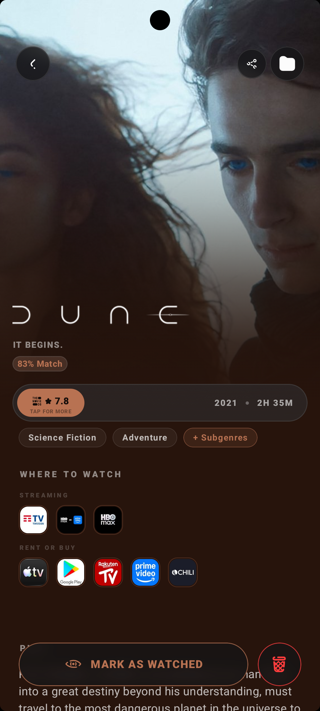
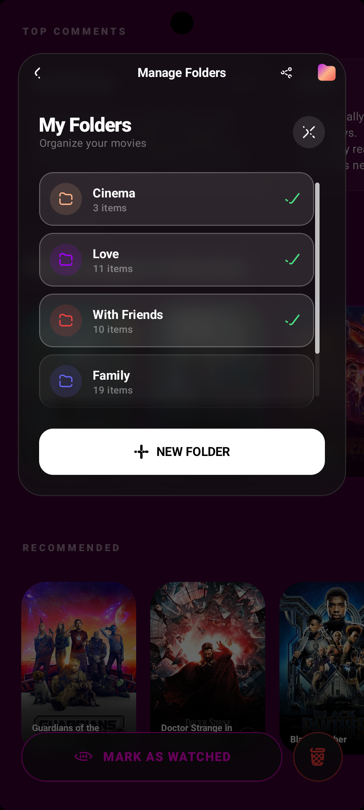

# 🎬 FlickTrove

  
  
  

**Track movies, TV shows, and actors with breathtaking style.**

*FlickTrove is a premium visual experience. A modern Android app built entirely with Jetpack Compose, featuring a unique glassmorphic interface, dynamic color palettes, and fluid high-refresh-rate animations.*

---

  
<b>📖 Table of Contents</b>

  <ol>
    <li><a href="#-the-project">🎯 The Project</a></li>
    <li><a href="#-key-features">✨ Key Features</a></li>
    <li><a href="#-ui-screenshots">📱 UI Screenshots</a></li>
    <li><a href="#%EF%B8%8F-architecture--technology">🛠️ Architecture & Technology</a></li>
    <li><a href="#-design--ui">🎨 Design & UI</a></li>
    <li><a href="#%EF%B8%8F-developer-note">⚠️ Developer Note</a></li>
    <li><a href="#-usage">🚀 Usage</a></li>
    <li><a href="#-license">📄 License</a></li>
    <li><a href="#-contacts--credits">📫 Contacts & Credits</a></li>
  </ol>

---

## 🎯 The Project

**What is the motivation behind FlickTrove?**
There are many apps for tracking movies and TV shows, but they often lack visual polish or feel sluggish. The goal of FlickTrove is to provide enthusiasts with not just a useful tool, but a premium, responsive, and delightful experience, fully utilizing modern Android technologies. 

This project solves the need for an elegant personal library, cloud-synchronized, with timely notifications for new releases.

---

## ✨ Key Features

FlickTrove is not just a tracker, it's a personal library built tailored for enthusiasts:

- 🔍 **Comprehensive Search**: Access the entire TMDB catalog. Find movies, TV shows, and explore biographical details and filmographies of actors.
- 📁 **Custom Organization**: Create custom folders. Assign names, dynamic colors via a Color Wheel, and organize your watchlists the way you prefer.
- 🔔 **Smart Notifications**: Never miss a release. Receive timely alerts when a movie or TV show episode you are waiting for is released.
- 📊 **Advanced Statistics**: Monitor your watch time, analyze your favorite genres, and see how much of your life you've dedicated to cinema and TV series.
- 🎬 **Episodic Tracking**: Keep track of which episodes you've already watched. Filter by seasons and always stay up to date with your favorite series.
- ☁️ **Cloud Sync**: Native support for Firebase to save your data (accounts & backups).
- 📴 **Offline-First**: Access your personal library and save your preferences even without an internet connection, thanks to solid local caching (Room DB).
- 🌍 **Localization**: Native multi-language architecture for an international experience (currently English and Italian).

---

## 📱 UI Screenshots

  <table>
    <tr>
      <td align="center"><b>Home & Blur Effect</b></td>
      <td align="center"><b>Recommendations</b></td>
      <td align="center"><b>Immersive Details</b></td>
    </tr>
    <tr>
      <td></td>
      <td></td>
      <td></td>
    </tr>
    <tr>
      <td align="center"><b>Advanced Statistics</b></td>
      <td align="center"><b>Custom Folders</b></td>
      <td align="center"><b>Deep Details</b></td>
    </tr>
    <tr>
      <td></td>
      <td></td>
      <td></td>
    </tr>
  </table>

---

## 🛠️ Architecture & Technology

Behind a gorgeous interface lies a solid and scalable engine. We used the best practices of modern Android development.

| Category | Stack / Library |
| :--- | :--- |
| **Language** |  |
| **Architecture** |  |
| **UI Framework** |   |
| **Networking** |   |
| **Local Database** |  |
| **Dependency Injection** |  |
| **Images & Colors** |  (Loading & Dynamic Color Extraction) |
| **Backend & Auth** |  |

<b>Technical Deep Dive</b>

 
FlickTrove adopts the most modern Android patterns: Kotlin Coroutines and Flows for reactive data management. Hilt simplifies dependencies, making the code testable and modular. Navigation is handled via the natively integrated Compose Navigation framework to avoid fragmentation.

---

## 🎨 Design & UI

Design is the true crown jewel of FlickTrove.

- 🪟 **Full Glassmorphism**: We use a custom blur engine to blur the content under panels, drawers, and top bars in real time at 60/120fps.
- 🌈 **Dynamic Theming**: The predominant colors of movie posters and backgrounds are dynamically extracted by Coil to theme the entire screen (gradients, buttons, and accents).
- ✨ **Premium Animations**: Micro-interactions, custom haptic feedback, and bounce-click effects make the app incredibly responsive and "alive" under your fingers.

---

## ⚠️ Developer Note

For security reasons, backend configuration files (such as Firebase's `google-services.json`) and private API keys (TMDB, OMDB, Trakt) have been excluded from this repository. 

Therefore, the project cannot be cloned and compiled "out-of-the-box". The source code is publicly exposed **solely for portfolio and review purposes**, to showcase the technical skills, architecture, and best practices adopted in the development of the app.

---

## 🚀 Usage

Once the app is launched:
1. Log in or create an account (data will be securely saved on Firebase).
2. Use the search bar to find your first movie or TV show.
3. Click "Add to library" and select which folder to put it in.
4. *(Optional)* Go to the "Stats" tab to monitor your watch time.

---

## 📄 License

Copyright © 2026 Alessandro Basile. All rights reserved.

This repository is public exclusively for portfolio and consultation purposes. Reproduction, copying, modification, or redistribution of the code, as well as its use for commercial or non-commercial purposes, is strictly prohibited without the explicit written permission of the author. Please consult the `TERMS_OF_SERVICE.md` file for further details.

---

## 📫 Contacts & Credits

**Contacts:**
* Alessandro Basile - alessandrobasile909@gmail.com
* Project Link: [https://github.com/Alle-0/FlickTrove_Kotlin](https://github.com/Alle-0/FlickTrove_Kotlin)

**Credits & Useful Resources:**
* [The Movie Database (TMDB) API](https://www.themoviedb.org/documentation/api) - For movie and TV show data
* [Shields.io](https://shields.io) - For README badges

 

  <i>Developed with passion for movie and TV show maniacs.</i>

