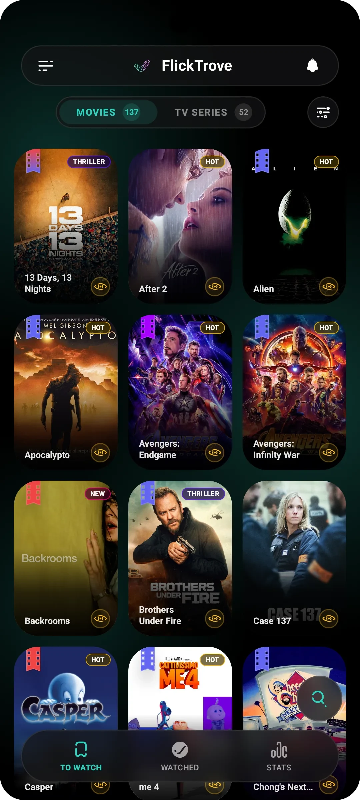
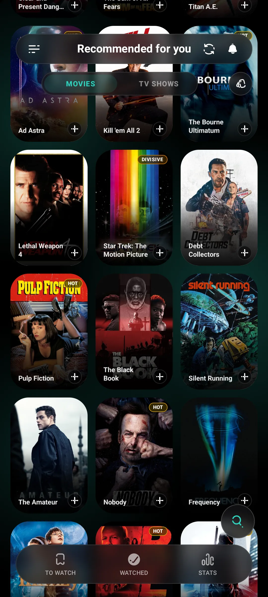
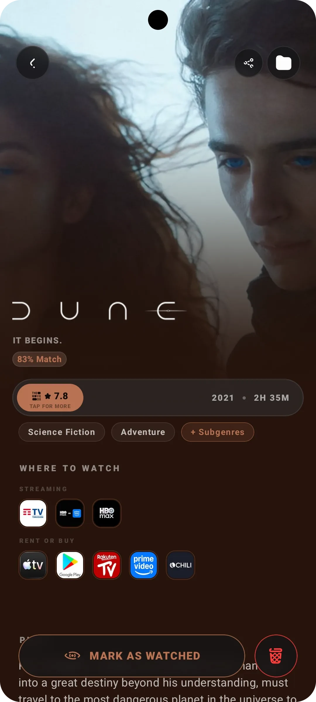
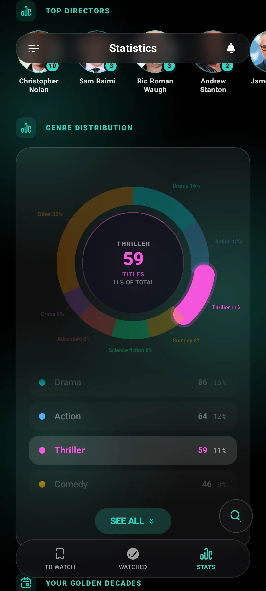
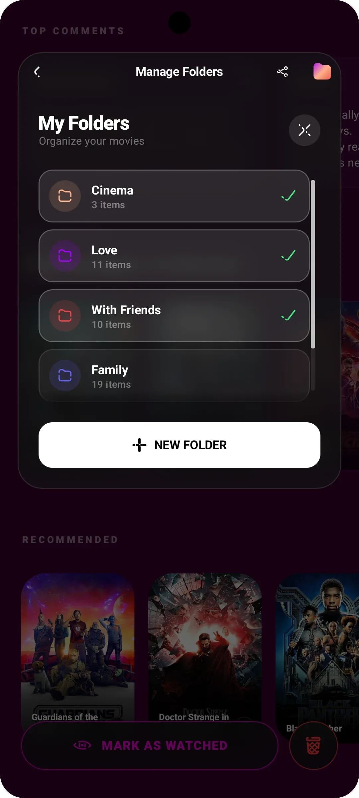
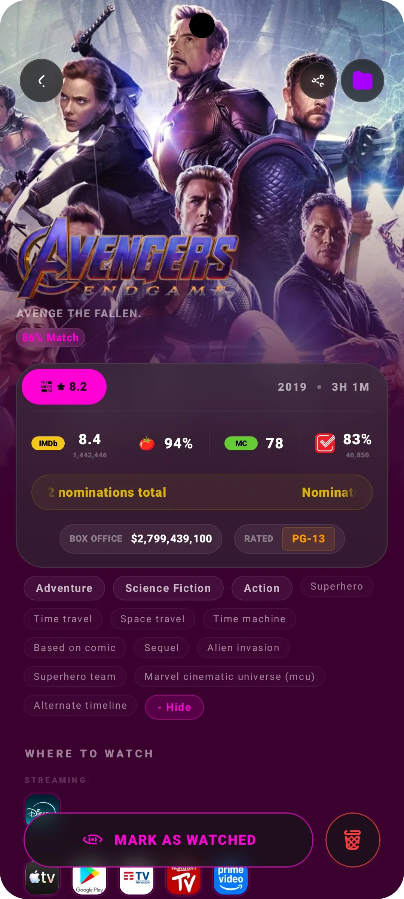

# FlickTrove — Premium Cinema & TV Show Tracker for Android

  
  
  
  
  
  

> **The ultimate personal cinema and TV show companion for Android.**
>
> *FlickTrove combines a unique glassmorphic interface, dynamic color palettes, and fluid animations with the full **TMDB catalog**, smart release notifications, and offline-first tracking built in **Kotlin** & **Jetpack Compose**.*

---

  
<b> Table of Contents</b>

  <ol>
    <li><a href="#the-project"> The Project</a></li>
    <li><a href="#download--installation"> Download & Installation</a></li>
    <li><a href="#key-features"> Key Features</a></li>
    <li><a href="#ui-screenshots"> UI Screenshots</a></li>
    <li><a href="#architecture--technology"> Architecture & Technology</a></li>
    <li><a href="#design--ui"> Design & UI</a></li>
    <li><a href="#developer-note"> Developer Note</a></li>
    <li><a href="#usage"> Usage</a></li>
    <li><a href="#support"> Support</a></li>
    <li><a href="#license"> License</a></li>
    <li><a href="#contacts--credits"> Contacts & Credits</a></li>
  </ol>

---

## <h2 id="the-project"> The Project</h2>

**What is the motivation behind FlickTrove?**
There are many apps for tracking movies and TV shows, but they often lack visual polish or feel sluggish. The goal of FlickTrove is to provide enthusiasts with not just a useful tool, but a premium, responsive, and delightful experience, fully utilizing modern Android technologies.

This project solves the need for an elegant personal library, cloud-synchronized, with timely notifications for new releases.

---

## <h2 id="download--installation"> Download & Installation</h2>

Experience FlickTrove on your Android device right now. Download the latest compiled APK directly from our releases page:

 

  

 

> **Note:** Since the app is not currently distributed via the Google Play Store, you will need to allow **"Install from unknown sources"** in your Android security settings before installing the downloaded APK file.

---

## <h2 id="key-feature"> Key Features</h2>

FlickTrove is not just a tracker, it's a personal library built tailored for enthusiasts:

- 🔍 **Comprehensive Search**: Access the entire TMDB catalog. Find movies, TV shows, and explore biographical details and filmographies of actors.
- 📁 **Custom Organization**: Create custom folders. Assign names, dynamic colors via a Color Wheel, and organize your watchlists the way you prefer.
- 🔔 **Smart Notifications**: Never miss a release. Receive timely alerts when a movie or TV show episode you are waiting for is released.
- 📊 **Advanced Statistics**: Monitor your watch time, analyze your favorite genres, and see how much of your life you've dedicated to cinema and TV series.
- 🎬 **Episodic Tracking**: Keep track of which episodes you've already watched. Filter by seasons and always stay up to date with your favorite series.
- ☁️ **Cloud Sync**: Native support for Firebase to save your data (accounts & backups).
- 📴 **Offline-First**: Access your personal library and save your preferences even without an internet connection, thanks to solid local caching (Room DB).
- 🌍 **Localization**: Native multi-language architecture for an international experience (currently English and Italian).
- 🍿 **Streaming Providers**: Discover exactly where to stream your favorite movies and shows.
- 📅 **Updates Zone**: A dedicated feed to keep track of upcoming episodes, theatrical releases, and latest news.
- 🔄 **Universal Data Import**: Smart migration engine that recognizes and imports exports from **Letterboxd**, **IMDb**, **Trakt.tv**, **TVTime**, **Serializd**, and any custom **CSV/JSON** format.

---

## <h2 id="ui-screenshots"> UI Screenshots</h2>

  <table>
    <tr>
      <td align="center"><b>Home & Blur Effect</b></td>
      <td align="center"><b>Recommendations</b></td>
      <td align="center"><b>Immersive Details</b></td>
    </tr>
    <tr>
      <td align="center">&nbsp;&nbsp;&nbsp;&nbsp;</td>
      <td align="center">&nbsp;&nbsp;&nbsp;&nbsp;</td>
      <td align="center">&nbsp;&nbsp;&nbsp;&nbsp;</td>
    </tr>
    <tr>
      <td align="center"> <b>Advanced Statistics</b></td>
      <td align="center"> <b>Custom Folders</b></td>
      <td align="center"> <b>Deep Details</b></td>
    </tr>
    <tr>
      <td align="center">&nbsp;&nbsp;&nbsp;&nbsp;</td>
      <td align="center">&nbsp;&nbsp;&nbsp;&nbsp;</td>
      <td align="center">&nbsp;&nbsp;&nbsp;&nbsp;</td>
    </tr>
  </table>

---

## <h2 id="architecture--technology"> Architecture & Technology</h2>

Behind a gorgeous interface lies a solid and scalable engine. We used the best practices of modern Android development.

| Category | Stack / Library |
| :--- | :--- |
| **Language** |  |
| **Architecture** |  |
| **UI Framework** |   |
| **Networking** |   |
| **Local Database** |  |
| **Dependency Injection** |  |
| **Images & Colors** |  (Loading & Dynamic Color Extraction) |
| **Backend & Auth** |  |

<b> Technical Deep Dive</b>

 
FlickTrove adopts the most modern Android patterns: Kotlin Coroutines and Flows for reactive data management. Hilt simplifies dependencies, making the code testable and modular. Navigation is handled via the natively integrated Compose Navigation framework to avoid fragmentation.

---

## <h2 id="design--ui"> Design & UI</h2>

Design is the true crown jewel of FlickTrove.

- 🪟 **Full Glassmorphism**: We use a custom blur engine to blur the content under panels, drawers, and top bars in real time at 60/120fps.
- 🌈 **Dynamic Theming**: The predominant colors of movie posters and backgrounds are dynamically extracted by Coil to theme the entire screen (gradients, buttons, and accents).
- ✨ **Premium Animations**: Micro-interactions, custom haptic feedback, and bounce-click effects make the app incredibly responsive and "alive" under your fingers.

---

## <h2 id="developer-note"> Developer Note</h2>

For security reasons, backend configuration files (such as Firebase's `google-services.json`) and private API keys (TMDB, OMDB, Trakt) have been excluded from this repository.

Therefore, the project cannot be cloned and compiled "out-of-the-box". The source code is publicly exposed **just for reference and sharing**, rather than as a plug-and-play application.

---

## <h2 id="usage"> Usage</h2>

Once the app is launched:

1. Log in or create an account (data will be securely saved on Firebase).
2. Use the search bar to find your first movie or TV show.
3. Click "To watch" and select which folder to put it in.
4. *(Optional)* Go to the "Stats" tab to monitor your watch time.

---

## <h2 id="future-roadmap"> Future Roadmap</h2>

FlickTrove is constantly evolving. In the future, the app will expand beyond a personal tracker into a fully social experience:

- [ ] **Social Integration:** Follow your friends and browse their personal libraries.
- [ ] **Shared Reviews:** Write custom reviews and rate movies, sharing your thoughts with the community.
- [ ] **Global Trends & Leaderboards:** Discover what's trending this week among other FlickTrove users.
- [ ] **Shared Folders:** Create collaborative watchlists with your partner or friends.
- [ ] **AI:** ?

---

## <h2 id="license"> License</h2>

Copyright © 2026 Alessandro Basile. All rights reserved.

This repository is public for reference and sharing. Reproduction, copying, modification, or redistribution of the code, as well as its use for commercial or non-commercial purposes, is strictly prohibited without the explicit written permission of the author. Please consult the `TERMS_OF_SERVICE.md` file for further details.

---

## <h2 id="support-the-project"> Support the Project</h2>

FlickTrove is, and will always be, completely free, open-source, and ad-free. If this app is helping you organize your cinema and TV library, consider supporting its development! Every little bit helps keep the project alive and expanding.

 

  
  &nbsp;&nbsp;&nbsp;&nbsp;
  

 

---

## <h2 id="contacts--credits"> Contacts & Credits</h2>

**Developed by:**

- 👨‍💻 **Alessandro Basile** - <alessandrobasile909@gmail.com>
- 🔗 **Project Link:** [FlickTrove on GitHub](https://github.com/Alle-0/FlickTrove) or [FlickTrove site](https://alle-0.github.io/FlickTrove)

**Credits & Useful Resources:**

- 🎬 [The Movie Database (TMDB) API](https://www.themoviedb.org/documentation/api) - For movie and TV show data
- 🛡️ [Shields.io](https://shields.io) - For README badges

 

  <i>Developed with passion for movie and TV show lovers.</i>

